# 🚀 Scalable MERN Deployment on AWS

A complete guide to deploying a **MERN (MongoDB, Express.js, React, Node.js)** application on **AWS EC2** with **Nginx reverse proxy**, **Application Load Balancers**, and **Cloudflare DNS integration**.  
This project demonstrates **DevOps best practices** for scalability, security, and high availability.

---

## 📘 Project Description
The project deploys a **Travel Memory application** using the MERN stack on AWS EC2 instances.  
Key highlights:  
- Separate **Application Load Balancers** for frontend and backend services  
- **MongoDB Atlas** for database storage  
- **Cloudflare DNS** for domain management and SSL integration  
- Ensures **scalable architecture** with redundancy and high availability  

---

## ✅ Requirements
1. MongoDB connection string  
2. VPC with 2 public and 2 private subnets  
3. AMI instance with prerequisites installed (Node.js, Nginx, Git)  
4. Two EC2 instances for backend and two EC2 instances for frontend  
5. Target Groups and Application Load Balancers for backend and frontend  
6. A domain name to host the website on the internet  

---

## 🏗 Architecture


**Flow of the application:**  
- End user opens browser → hits `https://www.yourdomain.com`  
- DNS routes request to **Frontend ALB** (HTTPS, port 443)  
- ALB performs health checks and distributes traffic across frontend EC2 instances  
- Frontend communicates with backend via backend DNS (`url.js`)  
- Request routed to **Backend ALB** (HTTPS, port 443)  
- Backend ALB performs health checks and forwards to backend EC2 instances  
- Backend communicates with **MongoDB Atlas** using connection string in `.env`  
- Response flows back: MongoDB → Backend → Backend ALB → Frontend → Browser  

> [!NOTE]  
> Architecture diagram can be reused from [draw.io resources](https://github.com/SaurabhSaurabh/scalable-mern-on-aws/tree/main/drawio-resources/scalable-MERN-on-AWS-architecture.io)

---

## ⚙️ Backend Configuration

### 1. Create a VPC (optional)
- Create a dedicated VPC for deployment (not mandatory).  

### 2. Launch EC2 Instance
- OS: Ubuntu  
- Type: `t3.micro`  
- Network: selected VPC  
- Subnet: public subnet  
- Auto-assign public IP: Enabled  
- Security group: allow SSH, HTTP, HTTPS, ports 3000 & 3001  

📸 *[Screenshot : EC2 instance creation]*  
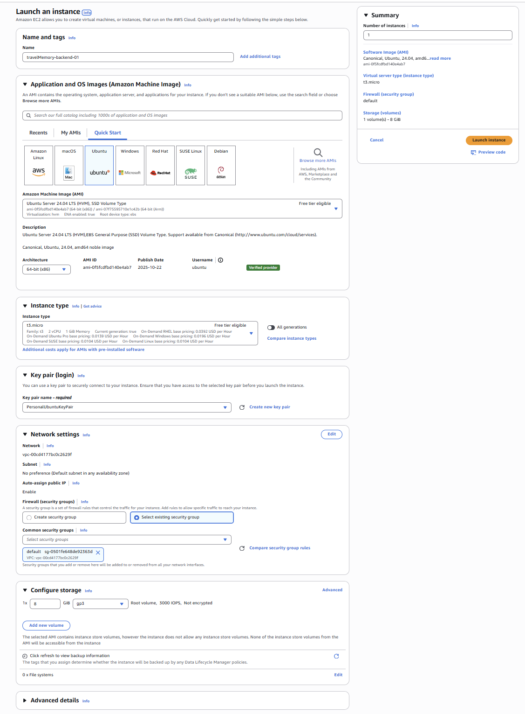

---

### 3. Install Dependencies & Configure Nginx
Update and upgrade OS packages:
```bash
sudo apt update && sudo apt upgrade -y
```

Install and start Nginx:
```bash
sudo apt install nginx -y
sudo systemctl start nginx
sudo systemctl enable nginx
```

Configure reverse proxy (`/etc/nginx/sites-available/default`):
```nginx
server {
    listen 80;
    server_name yourdomain.com www.yourdomain.com;
    
    location / {
        proxy_pass http://127.0.0.1:3001;
        proxy_http_version 1.1;

        proxy_set_header Host              $host;
        proxy_set_header X-Real-IP         $remote_addr;
        proxy_set_header X-Forwarded-For   $proxy_add_x_forwarded_for;
        proxy_set_header X-Forwarded-Proto $scheme;

        proxy_connect_timeout 10s;
        proxy_send_timeout    60s;
        proxy_read_timeout    60s;
    }
}
```

Install Node.js:
```bash
curl -fsSL https://deb.nodesource.com/setup_22.x | sudo -E bash -
sudo apt install -y nodejs
```

Clone repository:
```bash
git clone https://github.com/UnpredictablePrashant/TravelMemory
```

Create `.env` file:
```bash
nano .env
MONGO_URI='mongodb+srv://<user>:<password>@cluster.mongodb.net/travelmemory'
PORT=3001
```

Reload Nginx:
```bash
sudo nginx -t
sudo systemctl reload nginx
```

---

### 4. Create AMI Image(optional)
- Navigate to EC2 → Actions → Image and templates → Create image  
📸 *[Screenshot : AMI creation]*  
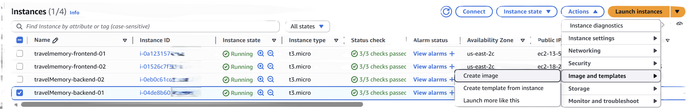

---

### 5. Scale EC2 Instances (optional)
- Create 1 or more EC2 instances from AMI 
- For now, create 1 more backend instances  

---

### 6. Install NPM & Start Backend
```bash
cd TravelMemory/backend
sudo npm install
node index.js
```

Verify versions:
```bash
node -v
npm -v
```

---

### 7. Verify Backend Server
- Access `http://<public-ip>/` → should display backend message  
- Access `http://<public-ip>/hello` → should return **Hello World**  

📸 *[Screenshot: Backend verification]*  
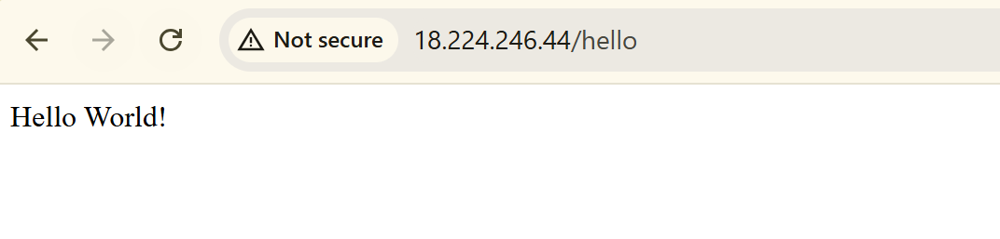

---

### 8. Create SSL Certificate with ACM
- Navigate to **AWS Certificate Manager (ACM)**  
- Request public certificate for domain(s)
- It will navigate to a page where it will have CNAME name and CNAME value  
- Add CNAME records in DNS provider (Cloudflare/Namecheap)
- Wait until ACM shows status as **Issued**  
📸 *[Screenshot: ACM certificate request & validation]*  
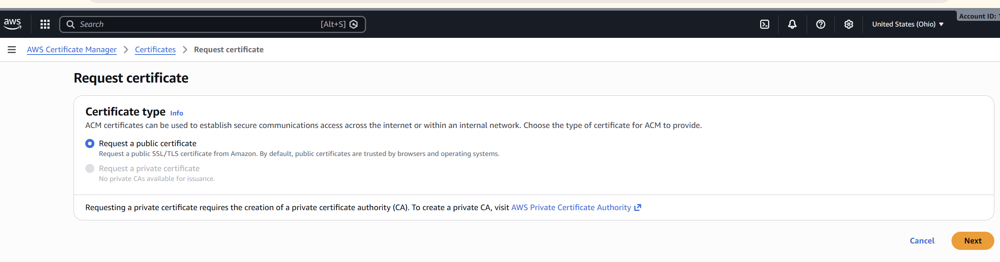

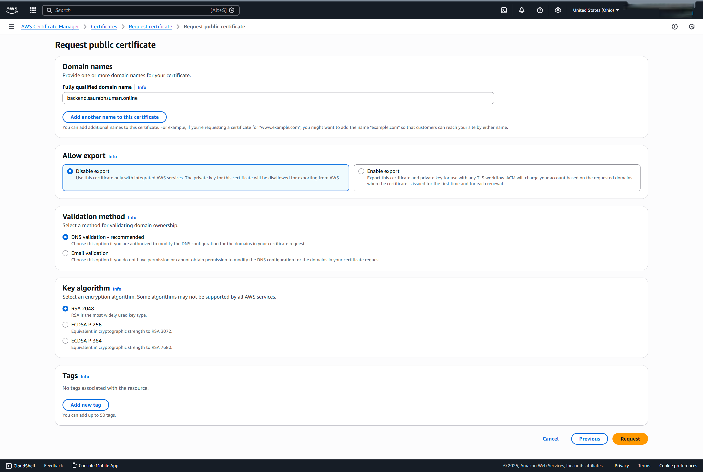

---

### 9. Create Target Group & Backend ALB
**Target Group:**  
- Type: Instances  
- Protocol: HTTP  
- Port: 80  
- Health check: `/hello`  
- Register backend EC2 instances  

**Application Load Balancer:**  
- Type: Application Load Balancer  
- Scheme: Internet-facing  
- Listener: HTTPS (443)  
- SSL Certificate: ACM-issued certificate  
- Forward traffic to backend target group  

📸 *[Screenshot : Backend ALB creation]*  

**Test:**  
- Access `https://<backend-alb-dns>/hello` → should return **Hello World**

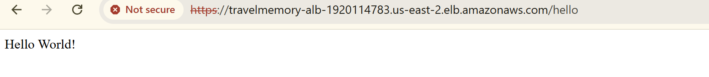

**DNS Mapping:**  
- Add CNAME record in Cloudflare:  
  - Type: CNAME  
  - Host: `backend`  
  - Value: `<backend-alb-dns>`  

📸 *[Screenshot : Cloudflare DNS entry]*  
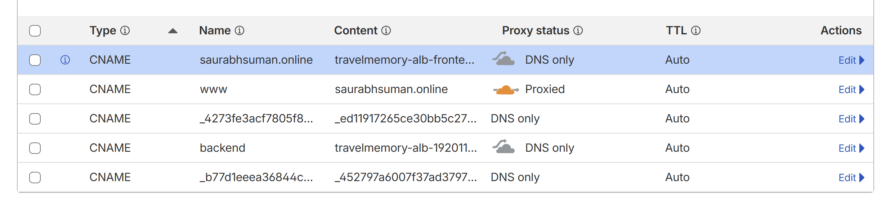

**Backend is now accessible at:**  
`https://backend.yourdomain.com`
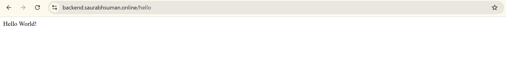

---

## 🎨 Frontend Configuration

### 1. Provision EC2 Instances
- Launch **1 EC2 instance** for frontend
- Configuration:  
  - OS: Ubuntu  
  - AMI: Select the custom AMI with pre-installed dependencies  
  - Network: Select created VPC  
  - Subnet: Public subnet  
  - Auto-assign public IP: Enabled  
  - Security group: allow SSH, HTTP, HTTPS, ports 3000 & 3001  

Clone repository:
```bash
git clone https://github.com/UnpredictablePrashant/TravelMemory
```

---

### 2. Configure `url.js` for Backend Communication
- Navigate to `TravelMemory/frontend/src`  
- Edit `url.js` to point to backend ALB DNS  

```js
export const baseUrl = process.env.REACT_APP_BACKEND_URL || "https://backend.yourdomain.com";
```
Example - export const baseUrl = process.env.REACT_APP_BACKEND_URL || "https://backend.saurabhsuman.online";

---

### 3. Install NPM & Start Frontend
Run commands on both frontend EC2 instances:

```
cd TravelMemory/frontend
sudo npm install
sudo npm run build # create optimized production build
```

Verify versions:
```
node -v
npm -v
```

Copy Build Files to Web Directory:
```
sudo mkdir -p /var/www/frontend
sudo cp -r ~/TravelMemory/frontend/build/* /var/www/frontend/
```

Set ownership and permissions:
```
sudo chown -R www-data:www-data /var/www/frontend
sudo chmod -R 755 /var/www/frontend
```

Configure Nginx:
```
Edit /etc/nginx/sites-available/default:

server {
    listen 80;
    server_name saurabhsuman.online www.saurabhsuman.online;

    root /var/www/frontend;
    index index.html;

    location / {
        try_files $uri /index.html;
    }
}
```

Explanation:

    root → points to the React build folder.

    try_files $uri /index.html; → ensures React routing works (fallback to index.html).

    server_name _; → allows Nginx to respond to ALB DNS (*.elb.amazonaws.com).


Reload nginx:
```
sudo nginx -t        # test config for syntax errors
sudo systemctl reload nginx
```

Verify locally:
```
curl -I http://localhost
```
Expected output:  
```HTTP/1.1 200 OK```


---

### 4. Create SSL Certificate with ACM
- Navigate to **AWS Certificate Manager (ACM)**  
- Request public certificate for `www.yourdomain.com`
- It will navigate to a page where it will have CNAME name and CNAME value  
- Add CNAME records in DNS provider (Cloudflare/Namecheap)  
- Wait until ACM shows status as **Issued**  

📸 *[Screenshot : ACM certificate for frontend]*  


---

### 5. Create Target Group & Frontend ALB
**Target Group:**  
- Type: Instances  
- Protocol: HTTP  
- Port: 80  
- Health check: `/` (root path)  
- Register frontend EC2 instances  

**Application Load Balancer:**  
- Type: Application Load Balancer  
- Scheme: Internet-facing  
- Listener: HTTPS (443)  
- SSL Certificate: ACM-issued certificate  
- Forward traffic to frontend target group  

📸 *[Screenshot : Frontend ALB creation]*  

**Test:**  
- Access `https://<frontend-alb-dns>` → should load React app homepage  

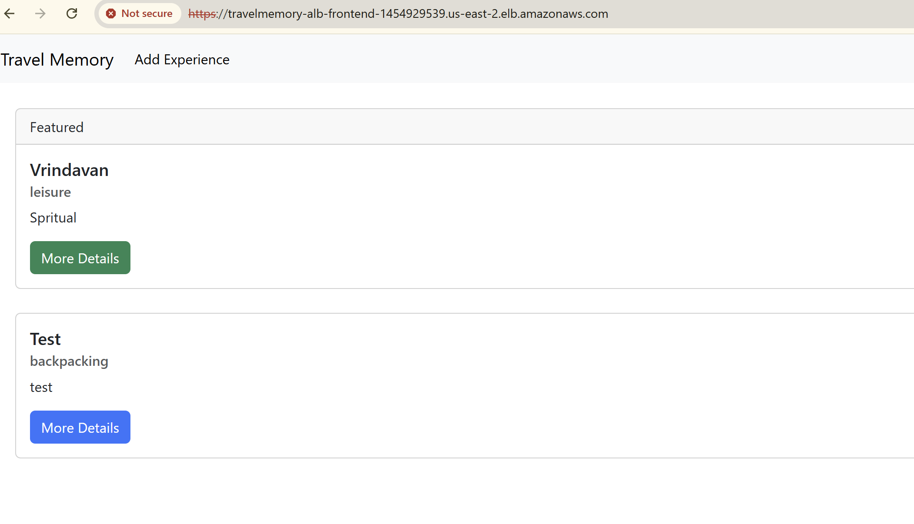

---

### 6. DNS Mapping
- Add CNAME record in Cloudflare:  
  - Type: CNAME  
  - Host: `www`  
  - Value: `<frontend-alb-dns>`  

📸 *[Screenshot: Cloudflare DNS entry for frontend]*  


**Frontend is now accessible at:**  
`https://www.yourdomain.com`
  
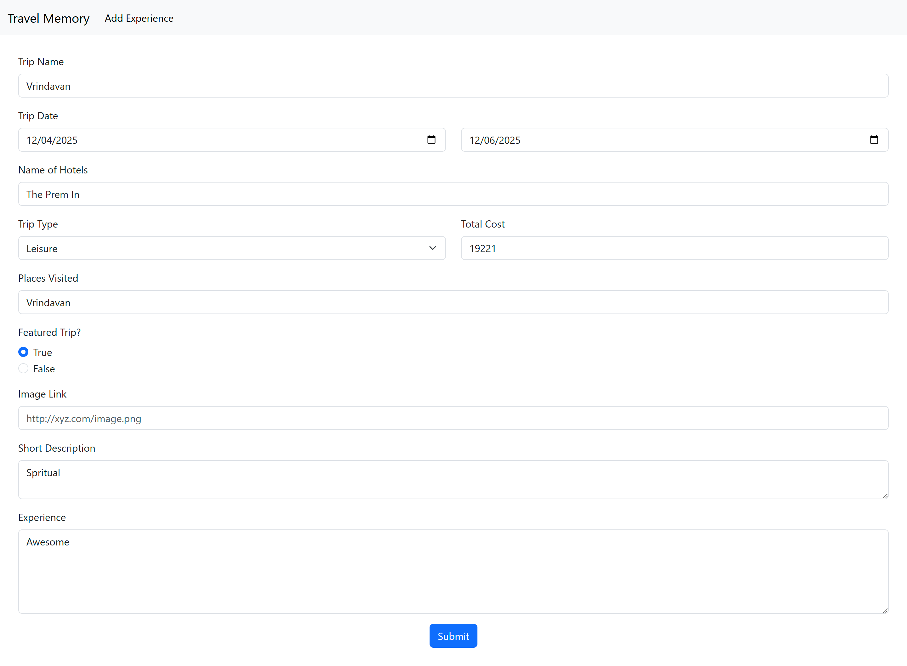
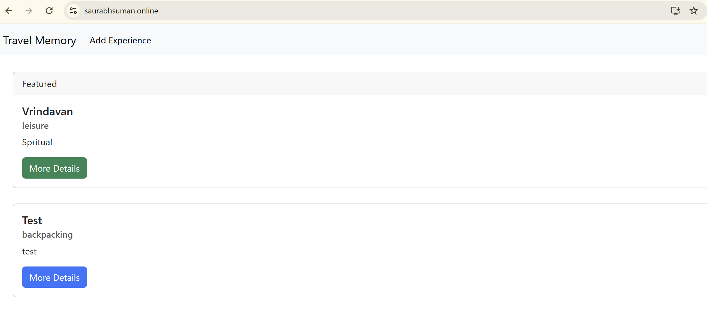
